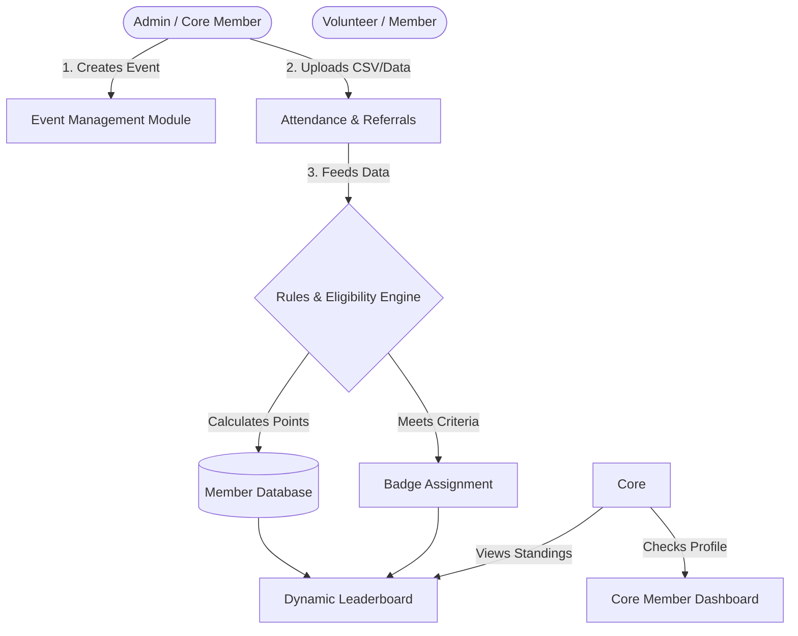

# NISBadges Platform 🏅

**NISBadges** is an internal automation and gamification platform built for the NIE IEEE Student Branch (NISB). It is designed to streamline event management, gamify volunteer participation, and track member contributions through an interactive badge and leaderboard system.

## 🚀 Features

* **Role-Based Access Control (RBAC):** Distinct dashboards and permissions for Core Members, Admins, and standard volunteers (`core_accounts`).
* **Member Management:** Track student profiles, onboarding, and overall engagement (`members`).
* **Event & Attendance Tracking:** Create events and seamlessly upload attendance records to track participation (`events`).
* **Automated Gamification:** Process referrals and automatically calculate badge eligibility based on predefined criteria (`leaderboard`).
* **Dynamic Leaderboard:** A real-time ranking system to foster healthy competition and recognize top-performing volunteers.
* **Modern UI:** Clean, responsive front-end utilizing custom Glassmorphism CSS for an elegant user experience.

## 🛠️ Tech Stack

* **Backend:** Python, Django
* **Frontend:** HTML5, CSS3 (Glassmorphism), Vanilla JavaScript
* **Database:** SQLite (Development)

## 📐 Architecture & Workflow

Here is how the NISBadges platform processes volunteer activity to generate the leaderboard. 

How it Works:
Data Ingestion: Administrators manage the club's roster and create events. Following an event, attendance or referral data is uploaded to the system.

Processing: The core engine evaluates the uploaded data against specific eligibility rules to calculate points.

Reward: If a member reaches certain milestones, the system automatically assigns them specific performance badges.

Display: The updated points and badges are instantly reflected on the global leaderboard and individual member dashboards.

💻 Local Setup & Installation
Follow these steps to get the project running on your local machine:

Clone the repository:

Bash
git clone [https://github.com/your-username/nisbadges-platform.git](https://github.com/your-username/nisbadges-platform.git)
cd nisbadges-platform
Create a virtual environment:

Bash:
python -m venv venv
source venv/bin/activate  # On Windows use: venv\Scripts\activate
Install dependencies:
(Assuming a requirements.txt will be added. If not, install Django manually)

Bash:
pip install django
Apply database migrations:

Bash:
python manage.py makemigrations
python manage.py migrate
Seed initial data (Optional):

Bash:
python manage.py seed_users
Run the development server:

Bash:
python manage.py runserver
Access the platform at http://127.0.0.1:8000.

## 🔮 Future Enhancements (DevOps & Cloud)
### To ensure high availability, zero-downtime deployments, and enterprise-grade scalability, the following infrastructure upgrades are planned:

--> Containerization: Writing a Dockerfile to containerize the Django application and its dependencies for consistent environments across dev, staging, and production.

--> CI/CD Pipeline: Implementing a robust Jenkins pipeline to automate testing, building, and pushing Docker images to a container registry upon every commit.

--> Container Orchestration: Deploying the application using Kubernetes (K8s) to manage scaling, load balancing, and self-healing of the application pods.

--> Cloud Deployment (AWS): * Migrating the database to Amazon RDS (PostgreSQL).

--> Hosting the Kubernetes cluster on Amazon EKS (Elastic Kubernetes Service).

--> Implementing Blue-Green deployment strategies (similar to the SwiftDeploy architecture) using Nginx as an Ingress controller to ensure zero downtime during platform updates.

Made with ❤️ for NISB
